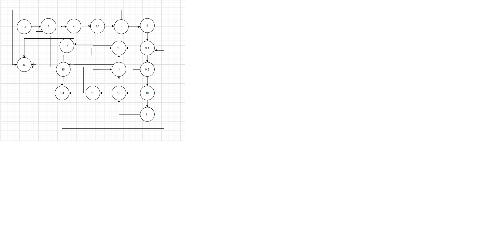
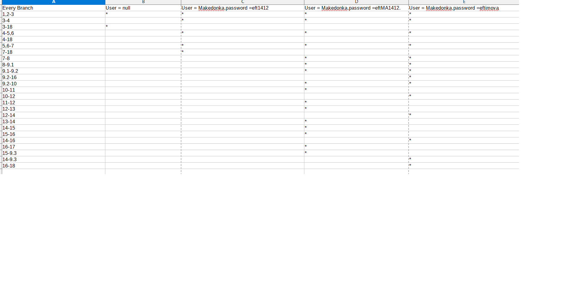
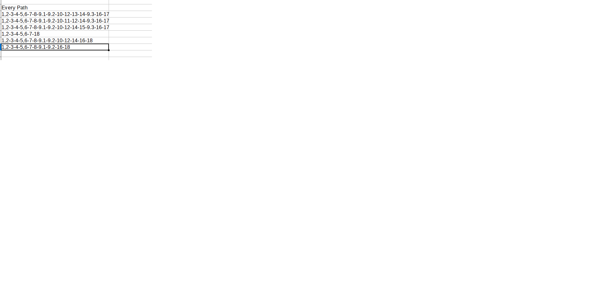
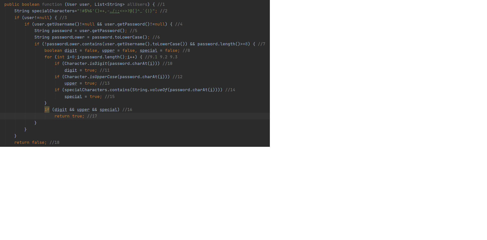

# SILaboratoriska2_162003

#Македонка Ефтимова 162003

#Група на код:
Ја добив групата на код 4

#Control Flow Graph

#Цикломатска комплексност
Цикломатската комплексност на овој код е 8,
ја добив преку броење на јазли и ребра,каде ребрата = 26 - 20(јазли) = 6 + 2 = 8. 
Истото се добива и преку предикатни јазли , каде предикатните јазли =  7 + 1 = 8.

#Тест случаи според критериумот Every Branch

#Тест случаи според критериумот Every path

#Дополнително слика од означените нодови

#Објаснување на напишаните unit tests
.............................
